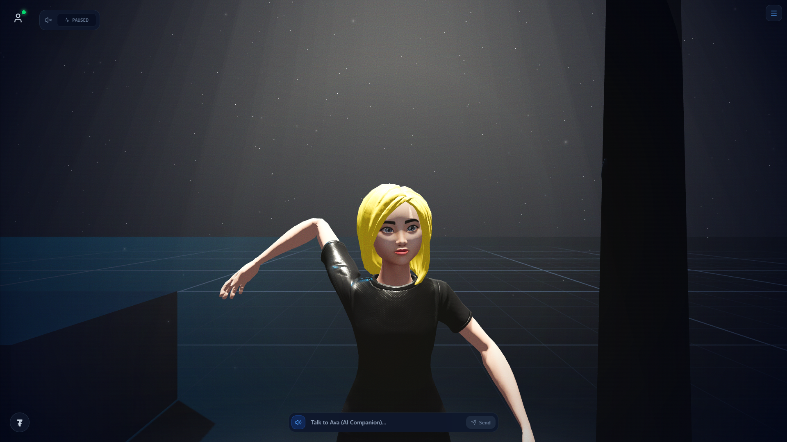
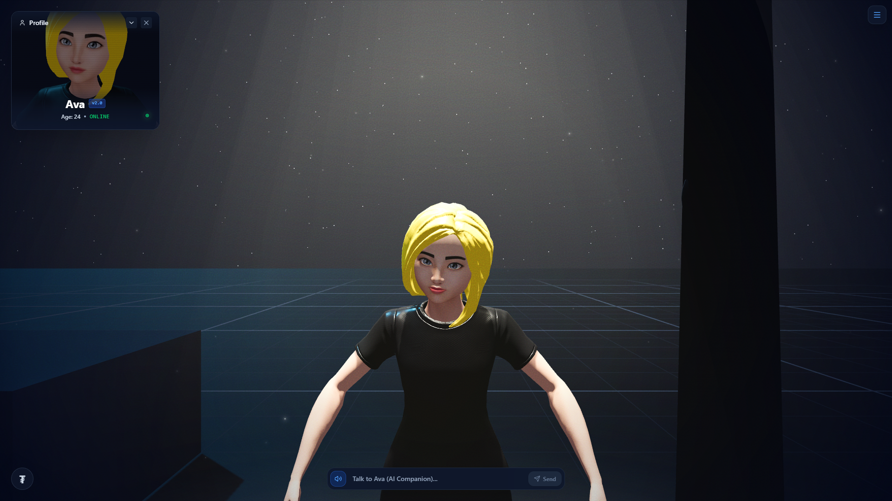
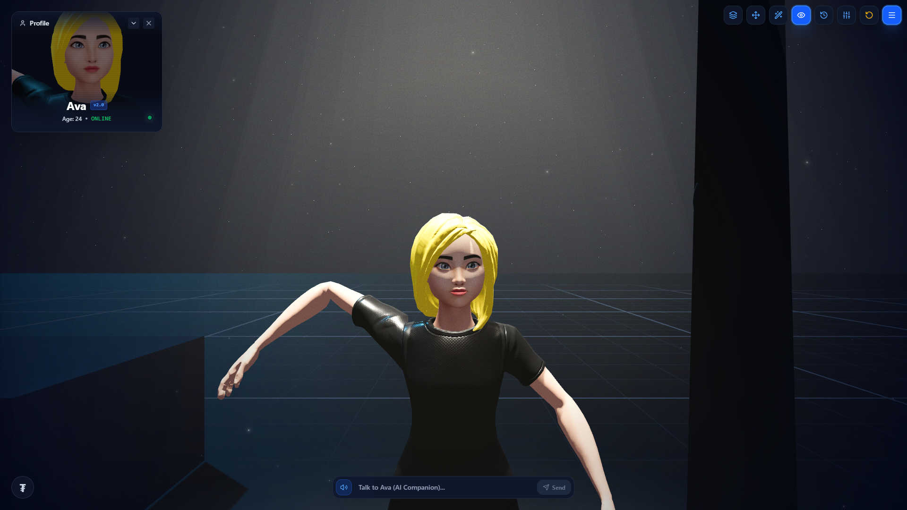

# 🌌 GridMap Studio — 3D Cyberpunk AI Companion & Studio

**Live Demo:** [Play Now on GitHub Pages](https://freecandy-dev.github.io/AI-GIRL-FRIEND/)

An interactive 3D WebGL web application featuring **Ava**, an AI-powered 3D companion driven by **Z.AI GLM-4.5-Flash** and multilingual female Text-to-Speech (TTS). Built with **React 18**, **Three.js / React Three Fiber**, **Tailwind CSS**, and **Rapier Physics**.

---

## 📸 Gallery

<p align="center">
  
  <br/>
  <em>Main 3D viewport with the AI companion, interactive physics objects, and dynamic UI</em>
</p>

<p align="center">
  
  <br/>
  <em>Expandable Character Profile with Real-time PiP CRT camera feed and RPG-style stats database</em>
</p>

<p align="center">
  
  <br/>
  <em>Expandable toolbars, camera controls, background music player, and USDT donation widget</em>
</p>

---

## ✨ Features

- 🤖 **Z.AI GLM-4.5-Flash AI Companion**: Real-time AI companion powered by Z.AI's GLM-4.5-Flash model with multilingual support (English, Hebrew, Spanish, French, German, Russian, Arabic, Japanese, Chinese) and spoken female voice output.
- 📊 **Dynamic Character Profile**: Expandable profile widget featuring a live Picture-in-Picture (PiP) 3D camera feed of Ava's face with CRT noise/glitch effects, and a highly detailed RPG-style database layout showing live character stats.
- 💻 **Simulated Ubuntu OS**: Clickable 3D laptop that triggers a full-screen interactive Ubuntu desktop interface. Includes a draggable Terminal, File Explorer with vacation pictures, an Image Viewer app, and a fully playable 2048 game!
- 🎵 **Chill Lo-Fi Audio**: Floating background music player with interactive visualizer bars, play/pause controls, and volume adjustments.
- 💰 **Crypto Donations**: Minimalistic floating ₮ (USDT) button with a quick TRC20 address copy-to-clipboard functionality to support development.
- 💬 **Interactive Speech Bubble**: Responses float cleanly directly on top of the prompt input bar with line wrapping and TTS audio playback.
- 💡 **Advanced Lighting & Environment**: Realistic directional lighting, soft ground light pools, ambient floating particles, and dynamic shadow casting across all 3D meshes.
- 🎥 **Cinematic Effects**: 5-Octave animated film grain filter and radial vignetting for a retro cinematic film aesthetic.
- 🕹️ **Dynamic Controls**:
  - WASD / Arrow Keys for character movement.
  - Dynamic Touch Joystick that appears seamlessly on touch screen devices.
  - OrbitControls free camera view and over-the-shoulder perspective.
  - Camera height scrollbar & permanent view saving.
- 🦴 **Single-Limb 3D Bone Dragging**: Drag individual limbs (arms, hands, legs) independently in 3D space with self-collision solvers.
- 🌌 **Starry Sky & Solid Floor Physics**: 6,000 glittering stars in the night sky backdrop and bulletproof 4-meter thick floor physics colliders.

---

## 🚀 Quick Start

### 1. Installation
```bash
npm install
```

### 2. Run Locally
```bash
npm run dev
```
Open [http://localhost:5173](http://localhost:5173) in your browser.

### 3. Build for Production / GitHub Pages
```bash
npm run build
```
The output will be in the `dist` directory, ready to be hosted on GitHub Pages or any static Web hosting provider.

---

## 🔑 Z.AI API Key Integration

The app comes pre-configured with Z.AI GLM-4.5-Flash API integration out-of-the-box. When hosted on GitHub Pages, client requests connect directly to Z.AI endpoints using model `glm-4.5-flash`.

---

## 🛠️ Tech Stack

- **Framework**: React 18 + Vite
- **3D Graphics**: Three.js, React Three Fiber (`@react-three/fiber`), Drei (`@react-three/drei`)
- **Physics**: Rapier 3D (`@react-three/rapier`)
- **Styling**: Tailwind CSS
- **Icons**: Lucide React
- **AI Model**: Z.AI GLM-4.5-Flash API
