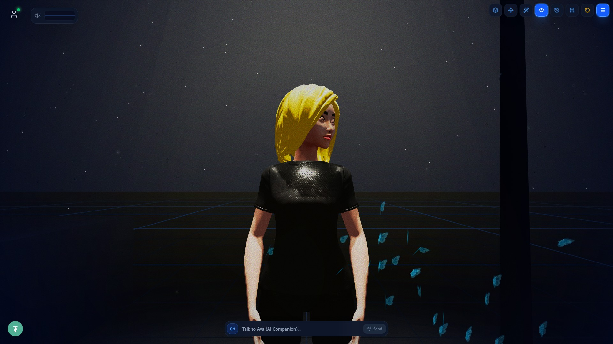
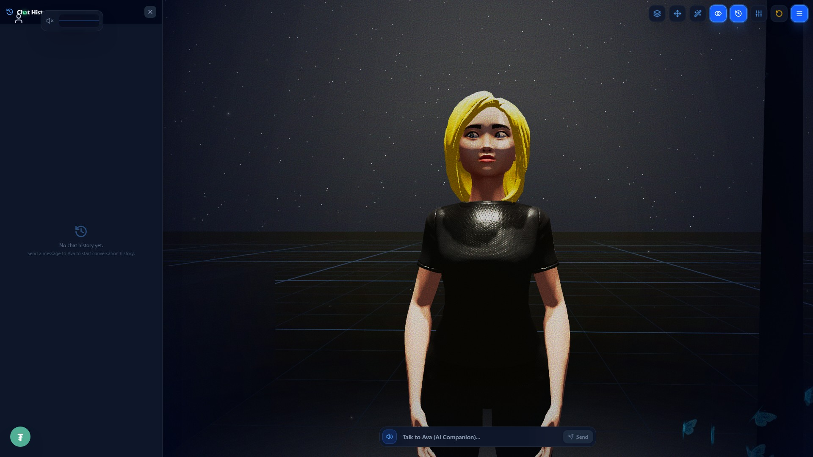
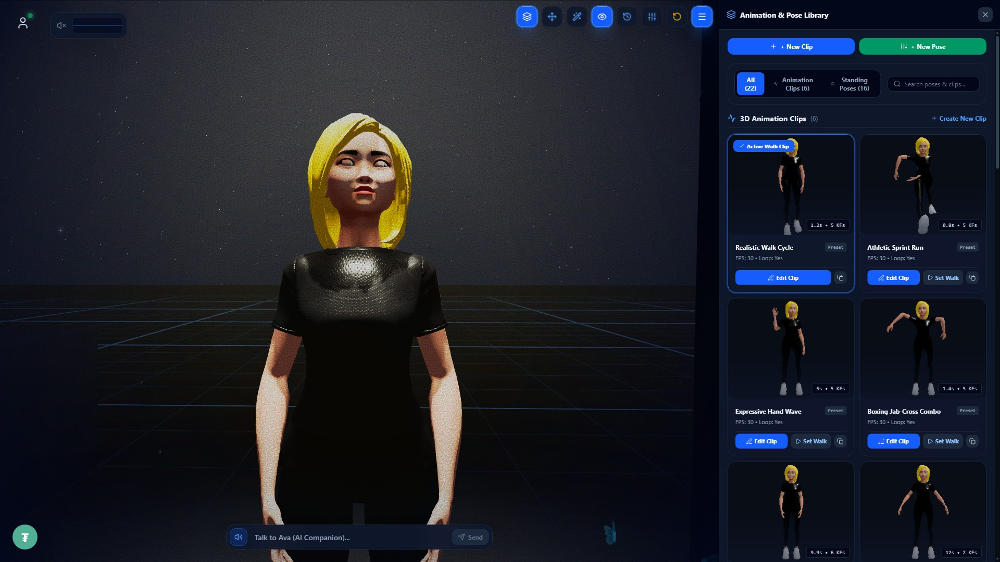
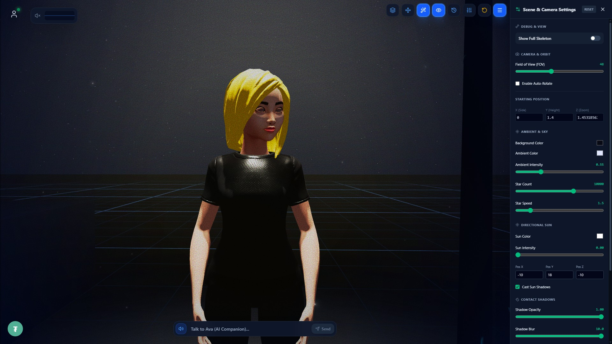
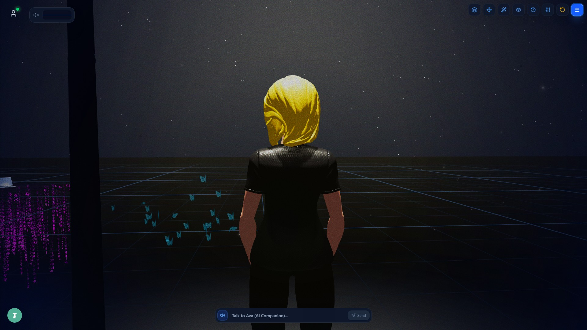

<div align="center">
  
  <br />
  <br />

  <h1>✨ AI-GIRL-FRIEND: 3D Studio & WebGL Companion ✨</h1>
  <p><strong>A futuristic, immersive 3D AI companion running directly in your browser. Powered by React, Three.js, and Vite.</strong></p>

  <p>
    
    
    
    
    
  </p>
</div>

<hr />

## 🌟 Features Showcase

### 💬 1. Intelligent AI Chat & Commands
> Engage in immersive conversations with a highly capable AI companion directly within the 3D world.
<div align="center">
  
</div>

- **Smart Context**: The AI remembers conversation history in the elegant Chat History Sidebar.
- **Slash Commands**: Type `/help` to see a magical command autocomplete menu hover above the chat input.
- **Animated Tutorials**: Trigger embedded tutorials (like the simulated terminal view) that play directly inside the chat UI!

---

### 💃 2. Advanced Animation & Pose Library
> Take full control of the 3D character model using a sleek, glassmorphic UI drawer.
<div align="center">
  
</div>

- **Seamless Transitions**: Smooth interpolation between hundreds of animations and idle states.
- **Real-time Previews**: Select animations from the grid to preview them instantly in the 3D world.
- **Bone Control**: Granular IK controls for custom poses.

---

### 🎛️ 3. Cinematic Scene Settings
> Craft the perfect aesthetic with comprehensive WebGL scene and lighting controls.
<div align="center">
  
</div>

- **Volumetric Lighting**: Toggle moonlight, streetlamps, and ambient occlusion settings.
- **Post-Processing**: Add intense cinematic film grain, bloom, and dynamic vignettes on the fly.
- **Environmental Controls**: Adjust starry sky density and procedural butterfly particle speeds.

---

### 🎥 4. Cinematic Camera Angles
> Instantly switch between Free Camera view and an immersive Over-The-Shoulder perspective.
<div align="center">
  
</div>

- **Over-The-Shoulder Tracking**: Camera dynamically follows the character's movements.
- **Dynamic Eye Tracking**: The character's gaze will naturally follow your cursor or interactions.

<hr />

## 🚀 Installation & Getting Started

Follow these steps to launch the experience locally on your machine.

### Prerequisites
Make sure you have [Node.js](https://nodejs.org/) installed on your machine.

### Setup

```bash
# 1. Clone the repository
git clone https://github.com/freecandy-dev/AI-GIRL-FRIEND.git

# 2. Enter the project directory
cd AI-GIRL-FRIEND

# 3. Install dependencies
npm install

# 4. Start the Vite development server
npm run dev
```

Visit `http://localhost:5173` (or the port shown in your terminal) to experience the app!

## 🛠️ Architecture & Technologies

- **Core Framework**: React 18
- **3D Rendering**: `@react-three/fiber` & `@react-three/drei`
- **Physics**: `@react-three/rapier` for rigid bodies and colliders
- **Styling**: TailwindCSS (v3) + PostCSS
- **Build Tool**: Vite (Lightning fast HMR)

---

<div align="center">
  <p>Built with ❤️ by the freecandy-dev team.</p>
</div>
